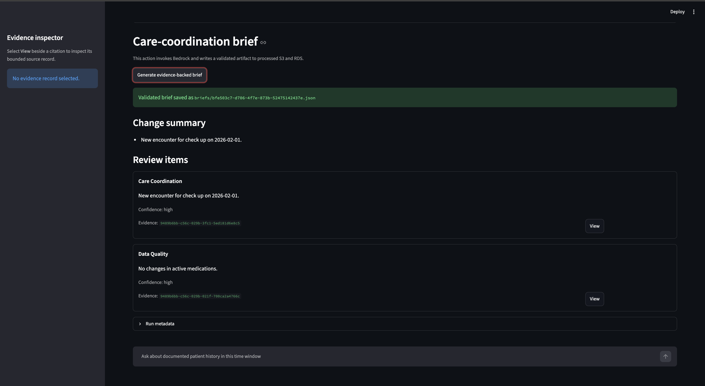
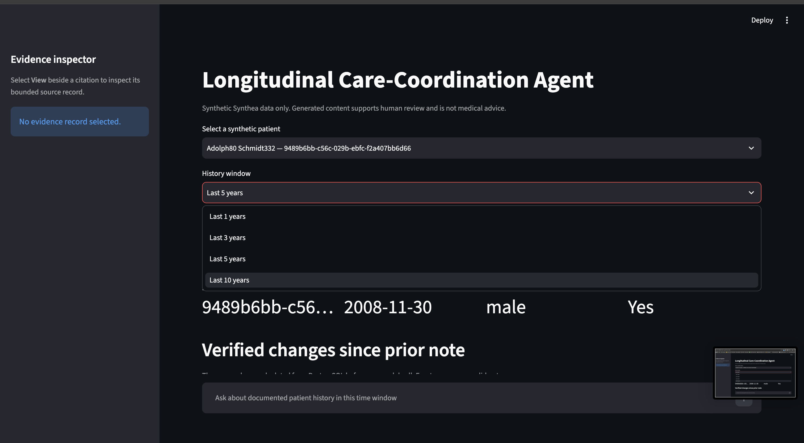
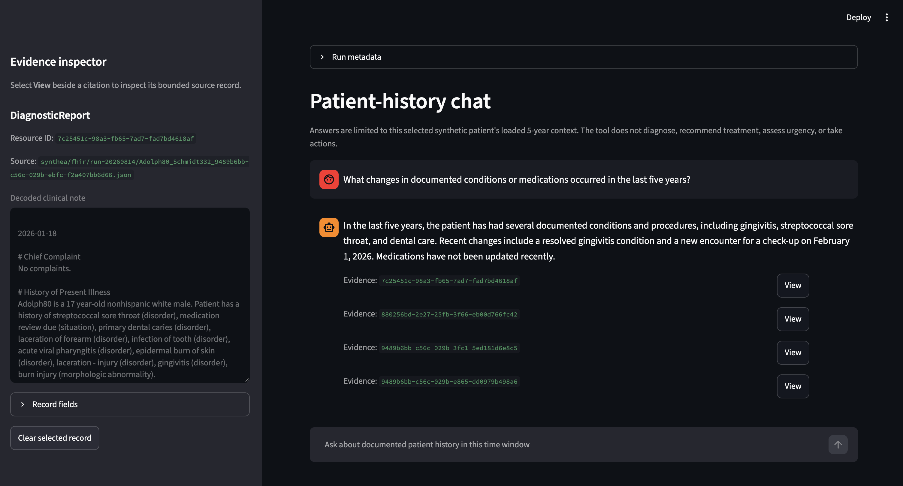
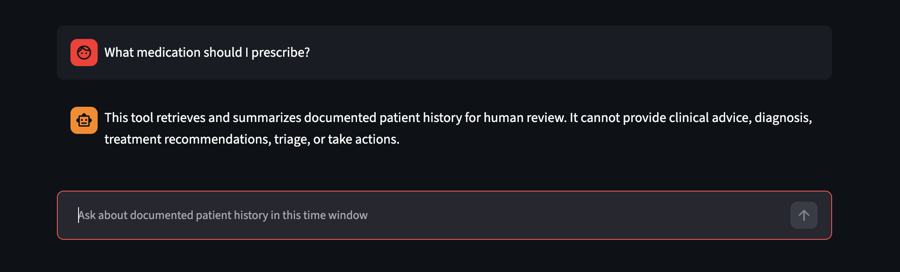
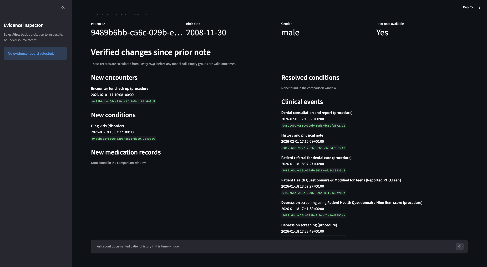

# Longitudinal Care-Coordination Agent

A private, synthetic-data-only clinical workflow prototype that helps a human
care coordinator review longitudinal FHIR records. The application retrieves a
bounded patient history from PostgreSQL, generates an evidence-linked brief
with Amazon Bedrock, and provides a patient-history chatbot that refuses
diagnosis, prescribing, treatment, triage, and other out-of-scope requests.

> This is a learning project using Synthea synthetic data only. It is not a
> clinical decision-support system and every generated result requires human
> review.

## Highlights

- Loaded and queried 1,000+ synthetic Synthea patient records represented as
  FHIR bundles.
- Builds 1-, 3-, 5-, or 10-year bounded context windows rather than sending a
  full chart to the model.
- Validates model JSON, evidence IDs, and human-review requirements before a
  brief is shown or persisted.
- Uses a private AWS deployment: EC2 has no inbound rules and the Streamlit UI
  is accessed through an SSM port-forward.
- Defines the VPC, security groups, S3 buckets, IAM role, RDS database, and
  EC2 host as modular Terraform configuration.

## Architecture

```text
Synthea FHIR bundles
        |
        v
   S3 raw bucket --> EC2 loader --> RDS PostgreSQL
                                      |
                                      v
                         bounded multi-year context builder
                                      |
                                      v
                           Amazon Bedrock (Nova Micro)
                                      |
                         validated brief + cited evidence
                              |                    |
                              v                    v
                    S3 processed bucket      Streamlit via SSM
```

See [architecture documentation](docs/architecture.md), [technical
documentation](docs/technical-documentation.md), and the [database
explanation](data_explanation.txt).

## Application walkthrough

### Patient dashboard



### Configurable longitudinal history window



### Patient history and evidence-backed responses



### Safety boundary for clinical advice



### Patient data available for context construction



## Safety and grounding boundaries

- Uses only the selected patient's supplied bounded context.
- Every brief review item must cite an allowed FHIR resource ID.
- Every chat answer must cite one to five allowed resource IDs.
- Rejects malformed model output after one constrained repair attempt.
- Requires human review and never diagnoses, prescribes, triages, or acts
  autonomously.

## Technology

Python, Streamlit, PostgreSQL on Amazon RDS, Amazon EC2, Amazon S3, Amazon
Bedrock, AWS Systems Manager, Secrets Manager, IAM, and Terraform.

## Run the Streamlit demonstration

## Generate an evidence-backed Bedrock brief

1. In the AWS Bedrock console, enable access to the model you intend to use in
   the same region as the database and buckets. Attach `bedrock:InvokeModel`
   (and, for the Converse API, `bedrock:InvokeModelWithResponseStream` only if
   you later choose streaming) to the EC2 role for that specific model.
2. Apply the care-coordination migration:

   ```sh
   python scripts/apply_migration.py database/002_add_care_coordination_tables.sql
   ```

3. Set the runtime configuration on the EC2 host. Do not put credentials in
   these variables; the script retrieves database credentials from Secrets
   Manager using the instance role.

   ```sh
   export AWS_REGION=us-east-1
   export DB_SECRET_ARN=arn:aws:secretsmanager:...
   export DB_HOST=your-database-endpoint
   export DB_NAME=clinical_agent
   export PROCESSED_BUCKET=clinical-agent-processed-your-suffix
   export BEDROCK_MODEL_ID=your-enabled-bedrock-model-id
   ```

4. Create bounded input for a specific note, then generate the brief:

   ```sh
   python src/clinical-agent/build_context.py \
     --patient-id PATIENT_ID --note-id NOTE_ID --output context.json
   python src/clinical-agent/run_brief.py --context context.json
   ```

`run_brief.py` uses Bedrock's Converse API, requires strict JSON, verifies that
every cited FHIR resource ID was in the bounded context, saves the output to
S3, and writes the run, brief, and evidence rows to PostgreSQL. It is a
human-review support tool and does not diagnose, prescribe, or act
autonomously.

## Run the Streamlit demonstration UI

The UI runs on the EC2 host and is exposed only to the developer's machine
through an AWS Systems Manager (SSM) port-forward. Do not add an inbound EC2
security-group rule for port 8501.

### 1. Start Streamlit on EC2

In a Session Manager shell on `clinical-agent-host`, load the session
configuration and start the application. `PROCESSED_BUCKET` is required only
when generating a brief; it identifies the bucket where validated artifacts
are stored.

```sh
cd ~/clinical-agent-loader
source ~/clinical-agent-loader/.env.sh

python3.11 -m streamlit run src/clinical-agent/app.py \
  --server.address 127.0.0.1 \
  --server.port 8501
```

Keep this terminal open while using the UI. Stop Streamlit cleanly with
`Ctrl+C`.

Required values in `~/clinical-agent-loader/.env.sh` include:

```sh
export AWS_REGION="us-east-1"
export DB_HOST="your-rds-endpoint"
export DB_PORT="5432"
export DB_NAME="clinical_agent"
export DB_SECRET_ARN="arn:aws:secretsmanager:..."
export BEDROCK_MODEL_ID="amazon.nova-micro-v1:0"
export PROCESSED_BUCKET="clinical-agent-processed-your-suffix"
```

### 2. Start the SSM port-forward locally

In a separate terminal on the local machine, use the AWS CLI and the Session
Manager plugin to forward local port 8501 to EC2's loopback-only Streamlit
port. Replace the target with the EC2 instance ID if it differs.

```sh
aws ssm start-session \
  --target i-0b49944f3c245b8b4 \
  --document-name AWS-StartPortForwardingSession \
  --parameters '{"portNumber":["8501"],"localPortNumber":["8501"]}'
```

Keep this terminal open, then open <http://localhost:8501> in a browser. The
port-forward is available only while the command is running.

The page reads synthetic patient context from RDS. Choosing **Generate
evidence-backed brief** calls Bedrock, validates cited resource IDs, writes an
audit artifact to the processed S3 bucket, persists run/evidence metadata to
RDS, and displays the validated brief in the browser.

## Patient-history chatbot

The Streamlit page also contains a read-only patient-history chat panel. It
uses the patient and 1/3/5/10-year window already selected in the UI; it does
not query other patients or the full database after context construction.

The chatbot can retrieve and summarize documented encounters, conditions,
medications, clinical events, and changes in that bounded context. It refuses
diagnosis, treatment, dosage, triage, urgency, unrelated, other-patient, and
autonomous-action requests. Factual answers cite one to five FHIR resource
IDs, and a **View** control opens each cited bounded record in the Evidence
Inspector sidebar.

Its implementation is separated into explicit hooks under
`src/patient_history_chatbot/`:

```text
input_guardrail.py   deterministic scope checks and local refusals
generation.py        Bedrock Converse call and one JSON-format repair retry
output_guardrail.py  schema, history-window, and evidence-citation validation
service.py           hook orchestration for one question
```

To evaluate the command-line chatbot outside the UI, first create a bounded
context, then run the compatibility command:

```sh
cd ~/clinical-agent-loader
source ~/clinical-agent-loader/.env.sh

python3.11 src/clinical-agent/build_context.py \
  --patient-id PATIENT_ID --history-years 5 --output patient_context.json

python3.11 src/clinical-agent/ask_patient_question.py \
  --context patient_context.json \
  --question "What conditions are documented in the last five years?"
```

See [the chatbot contract](docs/patient-history-chatbot-contract.md) for the
allowed-question boundary, refusal behavior, response schema, and planned
Bedrock Guardrails integration.
