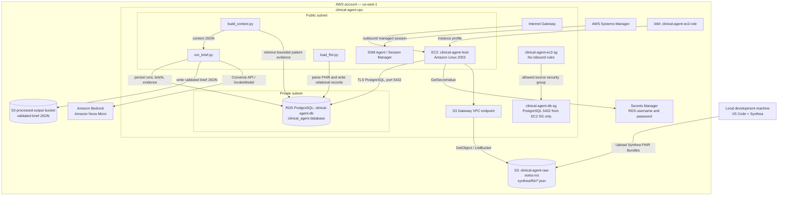

# Architecture Diagram

This diagram represents the currently implemented learning-project architecture
in `us-east-1`. All clinical data is synthetic Synthea data; no real patient
data is used.



## Runtime data flow

```text
Synthea FHIR Bundle
  → S3 source bucket
  → EC2 loader
  → RDS PostgreSQL
  → context builder (one patient, one current note, selected prior evidence)
  → Bedrock model
  → evidence-validated care-coordination brief
  → processed S3 bucket + RDS audit tables
```

The EC2 instance has no inbound security-group rules. Administration occurs
through Systems Manager Session Manager, rather than SSH. The RDS instance is
private and accepts PostgreSQL connections only from the EC2 security group.
